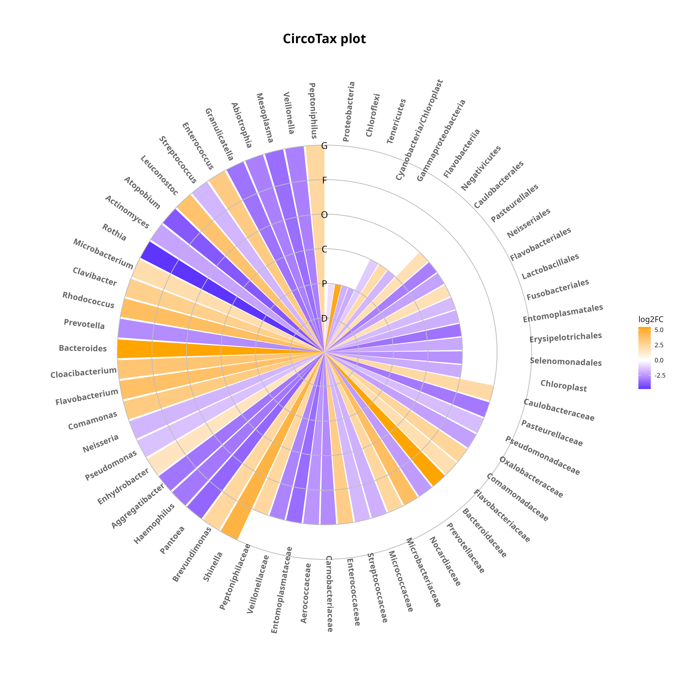
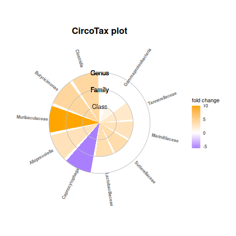
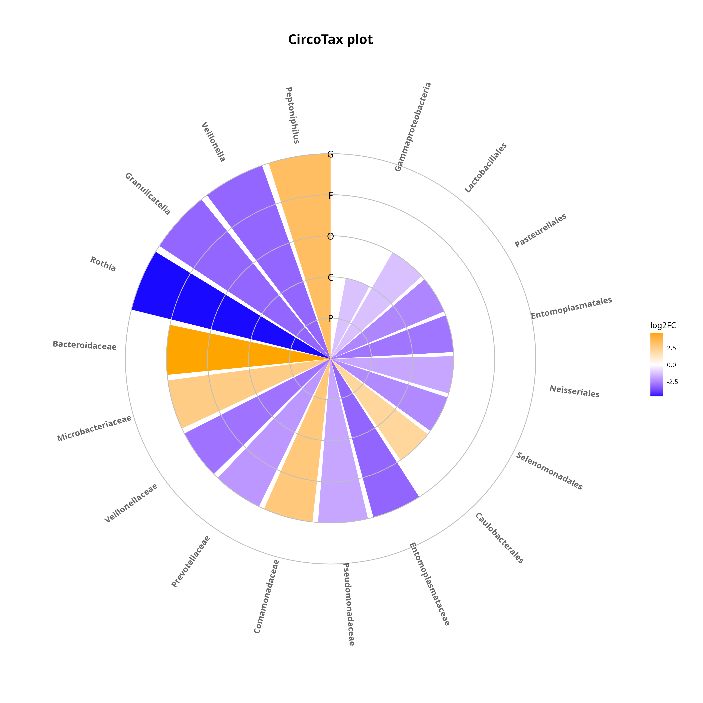
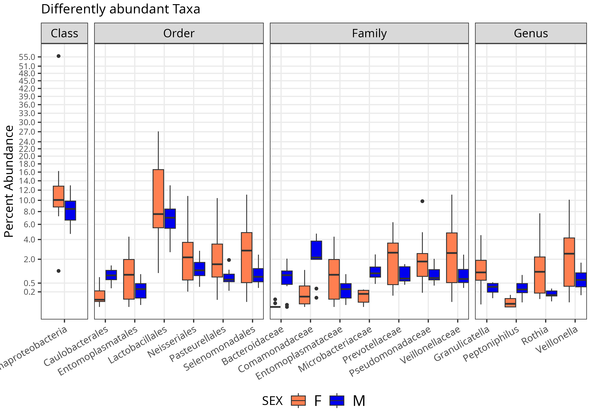

# CircoTax
CircoTax is an R function implementing a specialized *ggplot2* graph to represent in a radial form a rank-aware collection of differentially abundant taxa. Specifically, the CircoTax radial bar plot shows 6 or 7 sectors that encode the taxonomy depth (from kingdom to genus) and, departing from the center, a number of radial bars that reach the appropriate sector and whose color and transparency are proportional to the log fold change intensity and direction.
A basic Quickstart guide is provided here, please refer to the Documentation for additional information and tutorials.

<p align="center">
	
	
</p>

## Quickstart

Specific flavors of CircoTax has been developed to facilitate its usage:

- ***CircoTax()*** is the basic function to plot a complete *phyloseq* taxonomy matrix.

- ***CircoTax_custom()*** is a simpler version to plot custom data frames.

- ***CircoTax_DESeq2()*** and ***CircoTax_ALDEx2()*** implement a differential abundance analysis with the *DESeq2* and *ALDEx2* R packages respectively. 
  

### How to install

To install all the required dependencies from an R prompt:
```
if (!require("BiocManager", quietly = TRUE))
		install.packages("BiocManager")

install.packages(c("ggh4x","ggplot2","ashr"))
BiocManager::install("phyloseq")
BiocManager::install("ALDEx2")
BiocManager::install("apeglm")
```

> [!NOTE]  
> Not all of the above dependencies are strictly required to run CircoTax, please refer to the Documentation for additional details.

### How to plot a CircoTax using a complete taxonomy matrix

```
source("CircoTax.R")
data=read.delim("Tutorial/example_complete.txt",sep="\t")
CircoTax(data)
```

<p align="center">
	
</p>


In this example the CircoTax plot is representing 62 differentially abundant ranks, among which 27 are at genus level resolution, 18 at family level resolution, 10 at order level resolution, 3 at the class level resolution and 4 at phylum level resolution.

CircoTax can take a complete taxonomy matrix as an input, here we provide a subset from our tutorial dataset *example_complete.txt*:


| **log2FoldChange** | **Domain** |         **Phylum**        |      **Class**      |     **Order**     |     **Family**     |    **Genus**    |
|:------------------:|:----------:|:-------------------------:|:-------------------:|:-----------------:|:------------------:|:---------------:|
|       -0.741       |  Bacteria  |       Proteobacteria      |          NA         |         NA        |         NA         |        NA       |
|        5.294       |  Bacteria  |        Chloroflexi        |          NA         |         NA        |         NA         |        NA       |
|       -1.841       |  Bacteria  |        Tenericutes        |          NA         |         NA        |         NA         |        NA       |
|       -1.984       |  Bacteria  | Cyanobacteria/Chloroplast |          NA         |         NA        |         NA         |        NA       |
|       -1.221       |  Bacteria  |       Proteobacteria      | Gammaproteobacteria |         NA        |         NA         |        NA       |
|        2.146       |  Bacteria  |       Bacteroidetes       |    Flavobacteriia   |         NA        |         NA         |        NA       |
|       -1.726       |  Bacteria  |         Firmicutes        |    Negativicutes    |         NA        |         NA         |        NA       |
|        2.370       |  Bacteria  |       Proteobacteria      | Alphaproteobacteria |  Caulobacterales  |  Caulobacteraceae  |  Brevundimonas  |
|       -3.611       |  Bacteria  |       Proteobacteria      | Gammaproteobacteria | Enterobacteriales | Enterobacteriaceae |     Pantoea     |
|       -3.204       |  Bacteria  |       Proteobacteria      | Gammaproteobacteria |   Pasteurellales  |   Pasteurellaceae  |   Haemophilus   |
|       -3.242       |  Bacteria  |       Proteobacteria      | Gammaproteobacteria |   Pasteurellales  |   Pasteurellaceae  | Aggregatibacter |

Moreover, the following arguments can be specified:

- **title**: Title to display on the top of the plot.
- **fill_text**: Text to display above the color legend.
- **fc_col**: Column index of the input table containing the fold change values (an as.numeric column) to display through the gradient of the column. By default, the fold change values are searched in the first column of the input matrix.
- **tax_col**: Column indexes of the input table containing the full taxonomic path of each result. By default, the column indexes range from the second column to the last column. The function will automatically infer the presence or absence of certain taxonomic levels according to the number of columns.
- **sort**: Sorting logic of the results in the CircoTax. The possible inputs are "rank" (by taxonomic rank), "fc" (by fold change), "absfc" (by absolute fold change) and "alpha" (alphabetic order).
- **ramp**: Gradient of colors corresponding to fold change values range. Its input has to be a three character vector, where each character is a R color name. Defaults to c("blue","white","orange").
- **size_taxon_circo**: Size of the taxa labels (default=3).

### How to plot a CircoTax using a custom data frame

The "CircoTax_custom" function allows to plot a CircoTax from an R data.frame composed of three columns, namely taxon name, taxonomic rank name and value to display (e.g. FC).

```
source("CircoTax_custom.R")
data=read.delim("Tutorial/example_custom.txt",sep="\t")
CircoTax_custom(data)
```

<p align="center">
	
</p>

An input example is included in the file *example_custom.txt*, which was used for the above CircoTax plot:

|     **Tax_name**    | **Rank_name** |  **FC**  |
|:-------------------:|:-------------:|:--------:|
| Gammaproteobacteria |     Class     |  1.06736 |
|    Tannerellaceae   |     Family    | 2.398398 |
|    Marinifilaceae   |     Family    | 3.136581 |
|    Sutterellaceae   |     Family    | 3.808097 |
|   Lactobacillaceae  |     Family    | 3.624271 |
|    Capnocytophaga   |     Genus     | -5.55057 |
|    Alloprevotella   |     Genus     | 3.172175 |
|    Muribaculaceae   |     Genus     |    10    |
|    Butyricimonas    |     Genus     |  4.38531 |
|      Clostridia     |     Genus     | 4.235196 |


> [!NOTE]  
> The function *CircoTax_custom()* can take the same optional arguments as *CircoTax()* but defaults to different values. More information regarding this can be found in the Documentation.


### How to plot a CircoTax using Auto DA functions

***CircoTax_DESeq2()*** and ***CircoTax_ALDEx2()*** perform the differential analysis at each taxonomic level between two groups using either *DESeq2* or *ALDEx2*. They then filter the significant results and finally generate a tsv table, a box plot of percent abundances and a CircoTax plot of the results.

```
source("CircoTax_DESeq2.R")

load("Tutorial/data.RData")
data_to_analyse <- subset_samples(data, DISEASE=="H")
CircoTax_DESeq2(data_to_analyse, contrast = c("SEX","M","F"))
```

The above code is performed taking a *phyloseq* object named *data.RData* obtained by [*Elena Niccolai et al.*](https://doi.org/10.1186/s13293-023-00523-w) and results in the following CircoTax plot and boxplot:

<p align="center">
	
	
</p>

> [!NOTE]  
> Functions *CircoTax_DESeq2()* and *CircoTax_ALDEx2()* accepts additional arguments to customise the analysis. More information regarding this can be found in the Documentation.