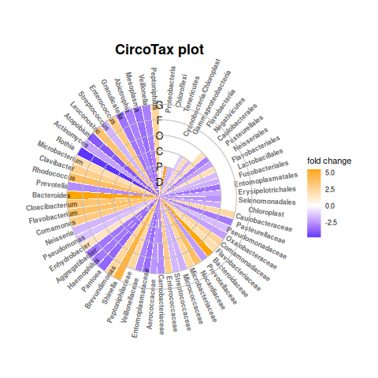
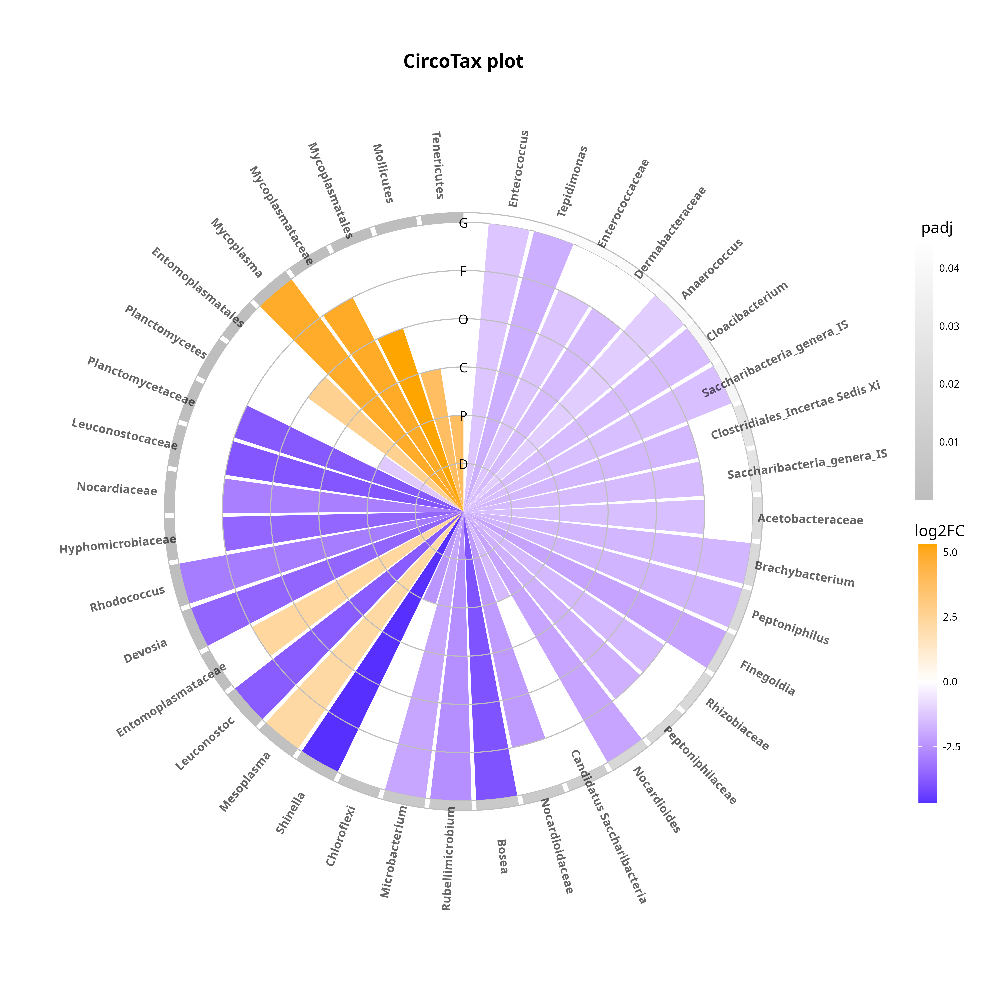
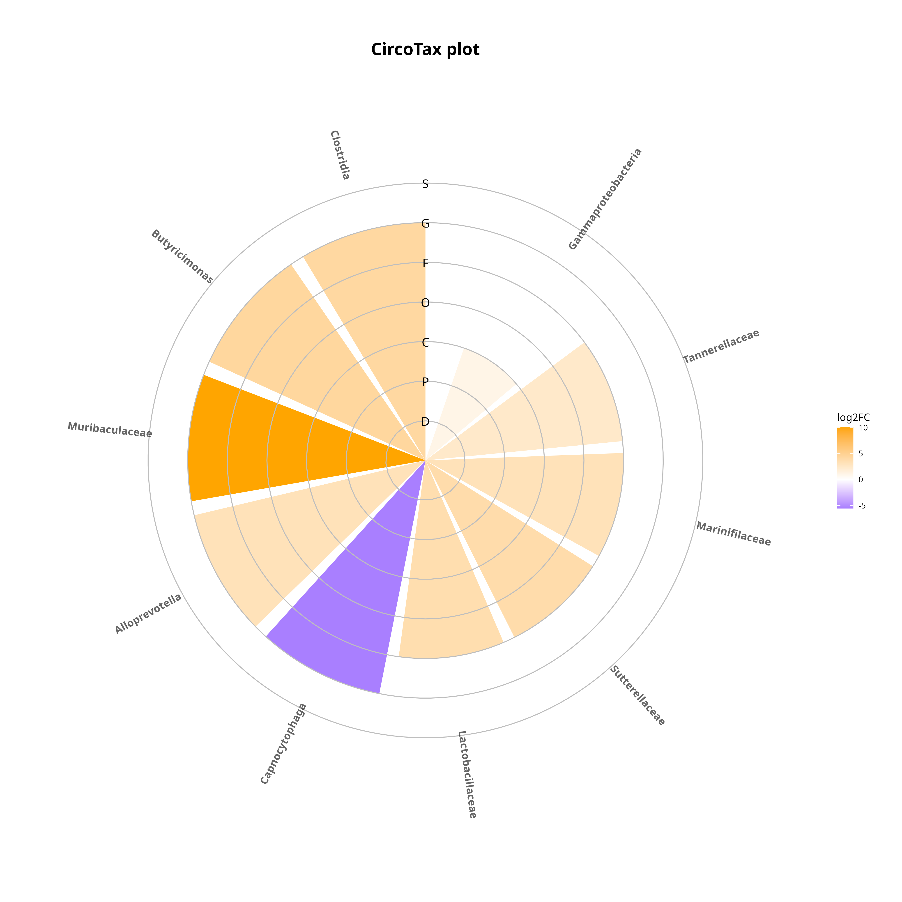
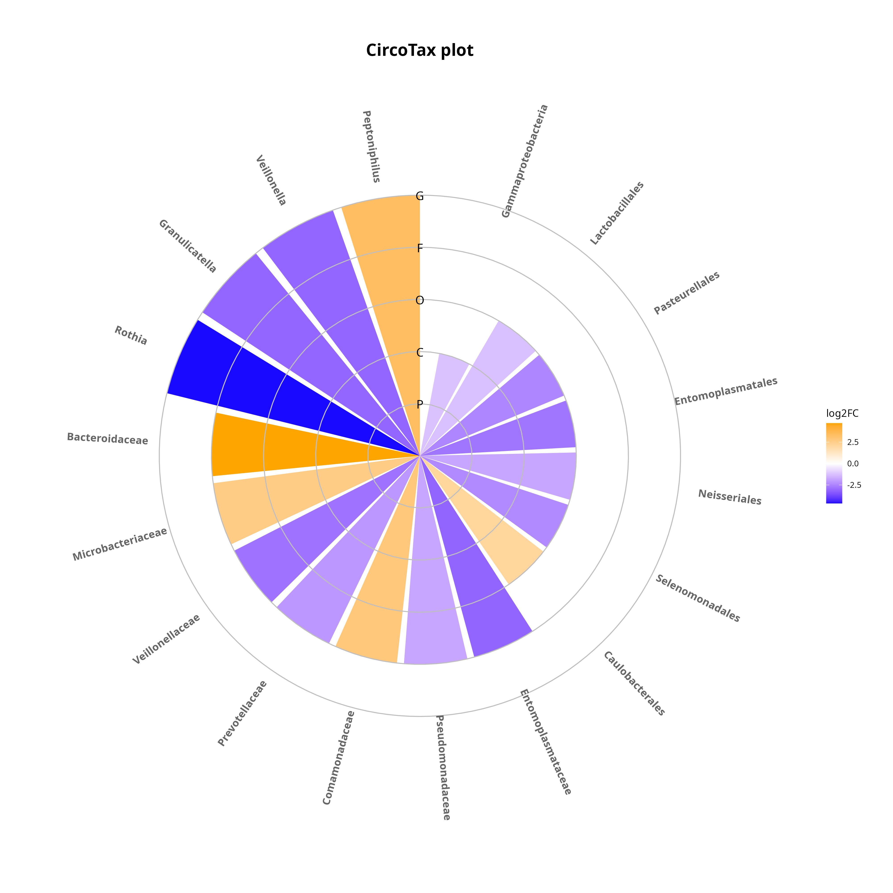
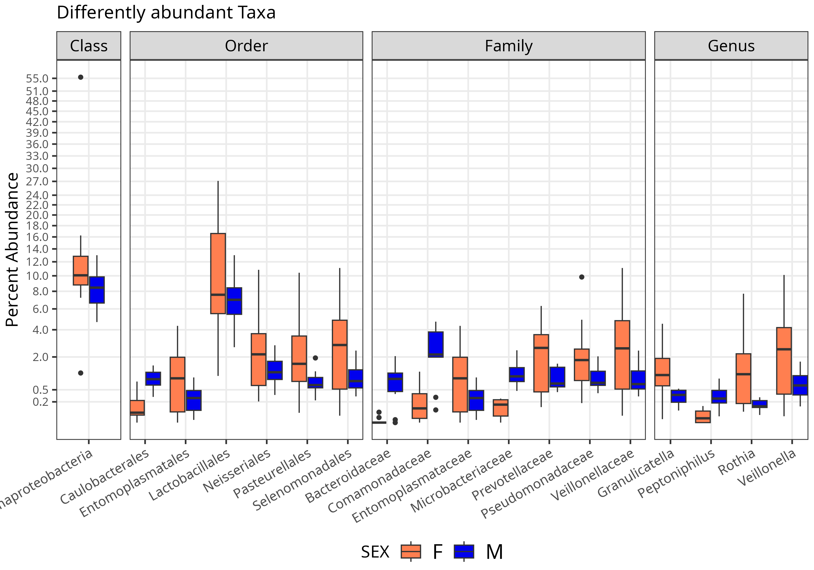

# CircoTax
CircoTax is an R function implementing a specialized `ggplot2` graph to represent in a radial form a rank-aware collection of differentially abundant taxa. Specifically, the CircoTax radial bar plot shows 6 or 7 sectors that encode the taxonomy depth (from kingdom to genus) and, departing from the center, a number of radial bars that reach the appropriate sector and whose color and transparency are proportional to the log fold change intensity and direction.
A basic Quickstart guide is provided here, please refer to the Documentation for additional information and tutorials.

<p align="center">
	
	
</p>

A Shiny R implementation module is available at [CircoTaxShiny](https://github.com/lorenzocasbarra/CircoTaxShiny) and an interactive live demo is available at [shinyapps.io](https://lorenzocasbarra.shinyapps.io/circotax-dashboard/).


## Quickstart

Specific flavors of CircoTax has been developed to facilitate its usage:

- `CircoTax()` is the basic function to plot a complete *phyloseq* taxonomy matrix or even custom data frames.

- `CircoTaxAutoDA()` implement a differential abundance analysis using either the *DESeq2* or *ALDEx2* R packages. 
  

### How to install

To install with *devtools* :

```r
	library("devtools")
	install_github("matteoramazzotti/CircoTax")
```
> [!NOTE]  
> Required dependencies should be installed automatically. In case of errors, please refer to the [Wiki](https://github.com/matteoramazzotti/CircoTax/wiki/Usage#installation).


### How to plot a CircoTax using a complete taxonomy matrix

```r
	library("circotax")
	file_format_1 <- system.file("extdata", "circotax_example_1.txt", package = "circotax")
	data = read.delim(file_format_1, sep = "\t")
	CircoTax(data, tax_col = 2:7, fc_col = 1)
```

<p align="center">
	
</p>


In this example the CircoTax plot is representing 62 differentially abundant ranks, among which 27 are at genus level resolution, 18 at family level resolution, 10 at order level resolution, 3 at the class level resolution and 4 at phylum level resolution.

CircoTax can take a complete taxonomy matrix as an input, here we provide a subset from our tutorial dataset [*circotax_example_1*](https://raw.githubusercontent.com/matteoramazzotti/CircoTax/refs/heads/main/inst/extdata/circotax_example_1.txt):


| **log2FoldChange** | **Domain** |         **Phylum**        |      **Class**      |     **Order**     |     **Family**     |    **Genus**    |
|:------------------:|:----------:|:-------------------------:|:-------------------:|:-----------------:|:------------------:|:---------------:|
|       -0.741       |  Bacteria  |       Proteobacteria      |          NA         |         NA        |         NA         |        NA       |
|        5.294       |  Bacteria  |        Chloroflexi        |          NA         |         NA        |         NA         |        NA       |
|       -1.841       |  Bacteria  |        Tenericutes        |          NA         |         NA        |         NA         |        NA       |
|       -1.984       |  Bacteria  | Cyanobacteria/Chloroplast |          NA         |         NA        |         NA         |        NA       |
|       -1.221       |  Bacteria  |       Proteobacteria      | Gammaproteobacteria |         NA        |         NA         |        NA       |
|        2.146       |  Bacteria  |       Bacteroidetes       |    Flavobacteriia   |         NA        |         NA         |        NA       |
|       -1.726       |  Bacteria  |         Firmicutes        |    Negativicutes    |         NA        |         NA         |        NA       |
|        2.370       |  Bacteria  |       Proteobacteria      | Alphaproteobacteria |  Caulobacterales  |  Caulobacteraceae  |  Brevundimonas  |
|       -3.611       |  Bacteria  |       Proteobacteria      | Gammaproteobacteria | Enterobacteriales | Enterobacteriaceae |     Pantoea     |
|       -3.204       |  Bacteria  |       Proteobacteria      | Gammaproteobacteria |   Pasteurellales  |   Pasteurellaceae  |   Haemophilus   |
|       -3.242       |  Bacteria  |       Proteobacteria      | Gammaproteobacteria |   Pasteurellales  |   Pasteurellaceae  | Aggregatibacter |


### How to plot a CircoTax using a custom data frame

The `CircoTax()` function allows to obtain a plot from an R data.frame composed of three columns, namely taxon name, taxonomic rank name and value to display (e.g. FC).

```r
	library("circotax")
	file_format_2 <- system.file("extdata", "circotax_example_2.txt", package = "circotax")
	data = read.delim(file_format_2, sep = "\t")
	CircoTax(data, names = 1, tax_col = 2, fc_col = 3)
```

<p align="center">
	
</p>

An input example is included in the file [*circotax_example_2*](https://raw.githubusercontent.com/matteoramazzotti/CircoTax/refs/heads/main/inst/extdata/circotax_example_2.txt), which was used for the above CircoTax plot:

|     **Tax_name**    | **Rank_name** |  **FC**  |
|:-------------------:|:-------------:|:--------:|
| Gammaproteobacteria |     Class     |  1.06736 |
|    Tannerellaceae   |     Family    | 2.398398 |
|    Marinifilaceae   |     Family    | 3.136581 |
|    Sutterellaceae   |     Family    | 3.808097 |
|   Lactobacillaceae  |     Family    | 3.624271 |
|    Capnocytophaga   |     Genus     | -5.55057 |
|    Alloprevotella   |     Genus     | 3.172175 |
|    Muribaculaceae   |     Genus     |    10    |
|    Butyricimonas    |     Genus     |  4.38531 |
|      Clostridia     |     Genus     | 4.235196 |


### How to plot a CircoTax with p-values

CircoTax can also plot p-values as colored crown arcs:

```r
	library("circotax")
	file_format_3 <- system.file("extdata", "circotax_example_3.txt", package = "circotax")
	data = read.delim(file_format_3, sep = "\t")
	CircoTax(data, tax_col = 9:14, fc_col = 8, pval_col = 7)
```

<p align="center">
	
</p>

An input example is included in the file [*circotax_example_3*](https://raw.githubusercontent.com/matteoramazzotti/CircoTax/refs/heads/main/inst/extdata/circotax_example_3.txt): 

| **name**      | **baseMean**         | **log2FoldChange**    | **lfcSE**             | **stat**              | **pvalue**               | **padj**                 | **lfcShrink**         | **Domain**   | **Phylum**                      | **Class**      | **Order**           | **Family** | **Genus** |
|-----------|------------------|-------------------|-------------------|-------------------|----------------------|----------------------|-------------------|----------|-----------------------------|------------|-----------------|--------|-------|
| DENOVO361 | 21.4736260581753 | -5.06261193420508 | 1.51987927151203  | -3.33093031077964 | 0.000865562687453    | 0.004039292541449    | -2.42389159983366 | Bacteria | Chloroflexi                 | NA         | NA              | NA     | NA    |
| DENOVO19  | 1538.97535211832 | 3.89585226987376  | 0.436664762708442 | 8.92183799239828  | 4.58612757144728E-19 | 6.42057860002619E-18 | 3.78227921927238  | Bacteria | Tenericutes                 | NA         | NA              | NA     | NA    |
| DENOVO214 | 48.0520027689096 | -7.33791827229029 | 1.59732005784811  | -4.59389352574451 | 4.3505141806025E-06  | 3.04535992642175E-05 | -1.22160728192622 | Bacteria | Planctomycetes              | NA         | NA              | NA     | NA    |
| DENOVO146 | 168.430687599077 | -2.35708457253219 | 0.818826382423731 | -2.87861337046225 | 0.003994276860386    | 0.011183975209081    | -1.57437353653794 | Bacteria | Candidatus Saccharibacteria | NA         | NA              | NA     | NA    |
| DENOVO19  | 1533.84004219576 | 3.92541902814169  | 0.488029228514476 | 8.04340969513317  | 8.73726005894387E-16 | 2.09694241414653E-14 | 3.78248901949319  | Bacteria | Tenericutes                 | Mollicutes | NA              | NA     | NA    |
| DENOVO19  | 1243.04595778702 | 5.6228444804319   | 0.711816112921221 | 7.8992936214331   | 2.8048843405529E-15  | 1.12195373622116E-13 | 5.30166800158731  | Bacteria | Tenericutes                 | Mollicutes | Mycoplasmatales | NA     | NA    |


> [!NOTE]  
> The function `CircoTax()` can also take optional arguments. More information regarding this can be found in the [Wiki](https://github.com/matteoramazzotti/CircoTax/wiki/Usage#circoTax).

### How to plot a CircoTax using Auto DA functions

`CircoTaxAutoDA()` perform the differential analysis at each taxonomic level between two groups using either `DESeq2` or `ALDEx2`. It then filters the significant results and finally generate a tsv table, a box plot of percent abundances and a CircoTax plot of the results.

```r
	library("circotax")
	library("phyloseq")

	data <- subset_samples(circotax::circotax_phyloseq_example, DISEASE == "H")
	df = CircoTaxAutoDA(data, mode = "DESeq2", contrast = c("SEX","M","F"))
	CircoTax(df) 
```

The above code is performed taking a *phyloseq* object named *circotax_phyloseq_example* which is bundled with our library and obtained by [*Elena Niccolai et al.*](https://doi.org/10.1186/s13293-023-00523-w) and results in the following CircoTax plot:

<p align="center">
	
	<!--  -->
</p>

> [!NOTE]  
> Functions `CircoTaxAutoDA()` accepts additional arguments to customise the analysis. More information regarding this can be found in the [Wiki](https://github.com/matteoramazzotti/CircoTax/wiki/Usage#circotaxautoda).